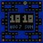
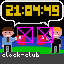
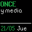
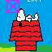
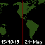

<p align="center">
  
</p>

<h1 align="center">Clockwise XE1E</h1>

<p align="center">
  <b>Reloj inteligente con matriz LED 64x64 y editor de caratulas</b>
</p>

<p align="center">
  <a href="https://github.com/XE1E/Clockwise-XE1E/actions/workflows/build-firmware.yml">
    
  </a>
  <a href="https://github.com/XE1E/Clockwise-XE1E/releases">
    
  </a>
  <a href="https://github.com/XE1E/Clockwise-XE1E/blob/main/LICENSE">
    
  </a>
</p>

<p align="center">
  <a href="#-instalacion-rapida">Instalacion</a> •
  <a href="#-herramientas-web">Herramientas</a> •
  <a href="#-funcionalidades">Funcionalidades</a> •
  <a href="#-hardware">Hardware</a> •
  <a href="#-documentacion">Docs</a>
</p>

---

## Caratulas de Ejemplo

<table align="center">
  <tr>
    <td></td>
    <td></td>
    <td></td>
    <td></td>
  </tr>
  <tr>
    <td></td>
    <td></td>
    <td></td>
    <td></td>
  </tr>
</table>

<p align="center"><i>Mario Bros y Pac-Man son caratulas nativas animadas integradas en el firmware</i></p>

---

## Instalacion Rapida

### Opcion 1: Web Flasher (Sin instalar nada)

1. Conecta tu ESP32 por USB
2. Abre **[Web Flasher](https://xe1e.github.io/Clockwise-XE1E/)** en Chrome/Edge
3. Haz clic en "Conectar" y selecciona el puerto
4. Haz clic en "Flashear"

### Opcion 2: Compilar desde codigo

```bash
git clone https://github.com/XE1E/Clockwise-XE1E.git
cd Clockwise-XE1E/firmware
pip install platformio
pio run -t upload
```

### Primera conexion

1. Enciende el reloj - aparecera "Conectando WiFi..."
2. Conectate a la red **"ClockWise-XE1E"** desde tu celular
3. Configura tu WiFi en la pagina que se abre
4. Accede a `http://clockwise-xe1e.local` para configurar

---

## Herramientas Web

Disponibles online, sin instalar nada:

| Herramienta | Descripcion |
|-------------|-------------|
| **[Web Flasher](https://xe1e.github.io/Clockwise-XE1E/)** | Instala el firmware desde el navegador |
| **[Editor de Caratulas](https://xe1e.github.io/Clockwise-XE1E/editor/)** | Disena caratulas con preview en tiempo real |
| **[Galeria](https://xe1e.github.io/Clockwise-XE1E/gallery/)** | Descarga caratulas listas para usar |

---

## Funcionalidades

### Editor de Caratulas
- Diseno visual con preview en tiempo real
- Prueba directa en el reloj via WiFi
- Textos, fechas, sprites animados, formas geometricas
- 26+ fuentes pixel art incluidas
- Generador de thumbnails automatico

### Reloj Inteligente
- **Multiples redes WiFi** - Guarda hasta 3 redes con failover automatico
- **Modo Nocturno** - Brillo reducido y caratula minimalista por horario
- **Rotacion automatica** - Cambia entre caratulas cada X minutos
- **Hora en palabras** - "DIEZ y media", "TRES y cuarto"
- **Brillo automatico** - Con sensor LDR opcional
- **Soporte Espanol** - Dias y meses en espanol

### Caratulas Nativas (Animadas)
- **Pac-Man** - El clasico comecocos con fantasmas
- **Mario Bros** - Mario, bloques con monedas, nubes animadas

---

## Hardware

| Componente | Especificacion |
|------------|----------------|
| Microcontrolador | ESP32 DevKit v1 / ESP32-S3 N16R8 |
| Display | Panel LED HUB75 64x64 pixels |
| Alimentacion | 5V / 4A minimo |
| Sensor (opcional) | LDR para brillo automatico |

### Pines HUB75 - ESP32

| Senal | GPIO | Notas |
|-------|------|-------|
| R1 | 25 | Rojo fila superior |
| G1 | 26 | Verde (27 si swap) |
| B1 | 27 | Azul (26 si swap) |
| R2 | 14 | Rojo fila inferior |
| G2 | 12 | Verde (13 si swap) |
| B2 | 13 | Azul (12 si swap) |
| A | 23 | Direccion linea |
| B | 19 | Direccion linea |
| C | 5 | Direccion linea |
| D | 17 | Direccion linea |
| E | 18 | Solo paneles 64x64 |
| CLK | 16 | Reloj |
| LAT | 4 | Latch |
| OE | 15 | Output Enable |

### Pines HUB75 - ESP32-S3

| Senal | GPIO | Notas |
|-------|------|-------|
| R1 | 4 | Rojo fila superior |
| G1 | 5 | Verde fila superior |
| B1 | 6 | Azul fila superior |
| R2 | 7 | Rojo fila inferior |
| G2 | 15 | Verde fila inferior |
| B2 | 16 | Azul fila inferior |
| A | 18 | Direccion linea |
| B | 8 | Direccion linea |
| C | 3 | Direccion linea |
| D | 42 | Direccion linea |
| E | 38 | Solo paneles 64x64 |
| CLK | 41 | Reloj |
| LAT | 40 | Latch |
| OE | 2 | Output Enable |

---

## Documentacion

| Documento | Contenido |
|-----------|-----------|
| [Manual de Usuario](docs/MANUAL_USUARIO.md) | Guia completa de uso |
| [Manual de Configuracion](docs/MANUAL_CONFIGURACION.md) | Configuracion avanzada |

---

## Estructura del Proyecto

```
Clockwise-XE1E/
├── firmware/           # Codigo ESP32 (PlatformIO)
│   ├── src/            # Main y logica principal
│   ├── lib/            # Librerias internas
│   └── clockfaces/     # Caratulas nativas (C++)
├── clockface-editor/   # Editor web de caratulas
├── web-flasher/        # Instalador web
└── docs/               # Documentacion
```

---

## Creditos

- **Proyecto original:** [Clockwise](https://github.com/jnthas/clockwise) por [@jnthas](https://github.com/jnthas)
- **Librerias:** ESP32-HUB75-MatrixPanel-DMA, Adafruit GFX, ezTime, ArduinoJson

---

## Licencia

Este proyecto mantiene la licencia del proyecto original. Ver [LICENSE](LICENSE).

---

<p align="center">
  <sub>Hecho con mass amor que mass de un reloj de pared merece</sub>
</p>
