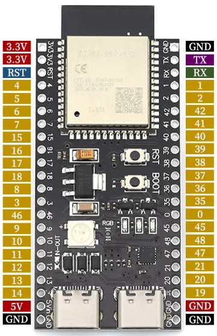
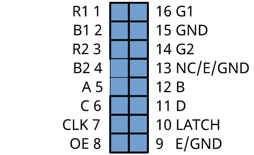

# Migración a ESP32-S3-DevKitC-1

Este documento describe los cambios necesarios para soportar la tarjeta ESP32-S3-DevKitC-1 en el proyecto Clockwise.

## Resumen

| Aspecto | ESP32 actual | ESP32-S3-DevKitC-1 |
|---------|--------------|---------------------|
| Board PlatformIO | `esp32doit-devkit-v1` | `esp32-s3-devkitc-1` |
| Chip | ESP32 (2016) | ESP32-S3 (2021) |
| CPU | Dual-core 240MHz | Dual-core 240MHz + AI acceleration |
| RAM | 520KB SRAM | 512KB SRAM + 8MB PSRAM (opcional) |
| Flash | 4MB | 8MB (típico) |
| USB | Via CP2102/CH340 | USB nativo (OTG) |
| LED integrado | GPIO 2 (simple) | GPIO 48 (RGB WS2812) |

## Impacto en desarrollo actual

**NO hay impacto** si se implementa como nuevo environment:
- El `default_envs = esp32dev` permanece sin cambios
- Compilación normal: `pio run` → usa ESP32 original
- Compilación para S3: `pio run -e esp32s3` → usa ESP32-S3
- Ambos environments pueden coexistir

## Cambios requeridos

### 1. platformio.ini

Agregar nuevo environment (no reemplazar el existente):

```ini
[env:esp32s3]
platform = espressif32
board = esp32-s3-devkitc-1
framework = arduino
test_ignore = test_native
monitor_speed = 115200
board_build.arduino.memory_type = qio_opi
build_flags =
    -D CW_FW_VERSION="\"1.0.0\""
    -D CW_FW_NAME="\"ClockWise-XE1E-S3\""
    -D CLOCKFACE_NAME="\"cw-cf-0x07\""
    -D BOARD_HAS_PSRAM
    -DARDUINO_USB_CDC_ON_BOOT=1
lib_deps =
    https://github.com/mrfaptastic/ESP32-HUB75-MatrixPanel-I2S-DMA.git
    adafruit/Adafruit GFX Library@^1.10.1
    adafruit/Adafruit BusIO@^1.5.0
    SPI
    Wire
    ropg/ezTime@^0.8.3
    https://github.com/jnthas/Improv-WiFi-Library
    bblanchon/ArduinoJson@^6.21.2
    bitbank2/PNGdec@^1.0.1
    https://github.com/me-no-dev/ESPAsyncWebServer.git
    https://github.com/me-no-dev/AsyncTCP.git
lib_extra_dirs =
    clockfaces
lib_ignore =
    cw-cf-0x01
    cw-cf-0x02
    cw-cf-0x03
    cw-cf-0x04
    cw-cf-0x05
    cw-cf-0x06
build_src_filter = +<*> -<.git/> -<.svn/> -<example/> -<examples/> -<test/> -<tests/>
```

### 2. main.cpp - LED integrado

El ESP32-S3-DevKitC-1 usa un LED RGB WS2812 en GPIO 48, no un LED simple.

**Opción A - Desactivar LED** (más simple):
```cpp
#ifdef CONFIG_IDF_TARGET_ESP32S3
  #define ESP32_LED_BUILTIN -1  // No usar LED en S3
#else
  #define ESP32_LED_BUILTIN 2
#endif
```

**Opción B - Usar LED RGB** (requiere librería adicional):
```cpp
#ifdef CONFIG_IDF_TARGET_ESP32S3
  #include <Adafruit_NeoPixel.h>
  #define ESP32_LED_BUILTIN 48
  Adafruit_NeoPixel rgbLed(1, ESP32_LED_BUILTIN, NEO_GRB + NEO_KHZ800);
#else
  #define ESP32_LED_BUILTIN 2
#endif
```

### 3. main.cpp - Configuración de pines HUB75

La biblioteca detecta automáticamente el ESP32-S3 y usa pines diferentes. Modificar `displaySetup()`:

```cpp
void displaySetup(bool swapBlueGreen, uint8_t displayBright, uint8_t displayRotation)
{
  HUB75_I2S_CFG mxconfig(64, 64, 1);

#ifdef CONFIG_IDF_TARGET_ESP32S3
  // ESP32-S3: usa pines por defecto de la biblioteca
  // Solo necesitamos configurar el pin E para paneles 64x64
  mxconfig.gpio.e = 38;  // Elegir GPIO disponible
  
  // Si tu panel tiene colores invertidos en S3, descomentar:
  // mxconfig.gpio.b1 = 5;
  // mxconfig.gpio.b2 = 15;
  // mxconfig.gpio.g1 = 6;
  // mxconfig.gpio.g2 = 16;
  
#else
  // ESP32 original: configuración actual
  if (swapBlueGreen)
  {
    mxconfig.gpio.b1 = 26;
    mxconfig.gpio.b2 = 12;
    mxconfig.gpio.g1 = 27;
    mxconfig.gpio.g2 = 13;
  }
  mxconfig.gpio.e = 18;
#endif

  mxconfig.clkphase = false;

  dma_display = new MatrixPanel_I2S_DMA(mxconfig);
  dma_display->begin();
  dma_display->setBrightness8(displayBright);
  dma_display->clearScreen();
  dma_display->setRotation(displayRotation);
}
```

## Cableado físico

### Pinout ESP32-S3-DevKitC-1 para HUB75

| Señal HUB75 | GPIO ESP32-S3 | Notas |
|-------------|---------------|-------|
| R1 | 4 | Rojo fila superior |
| G1 | 5 | Verde fila superior |
| B1 | 6 | Azul fila superior |
| R2 | 7 | Rojo fila inferior |
| G2 | 15 | Verde fila inferior |
| B2 | 16 | Azul fila inferior |
| A | 18 | Dirección línea bit 0 |
| B | 8 | Dirección línea bit 1 |
| C | 3 | Dirección línea bit 2 |
| D | 42 | Dirección línea bit 3 |
| E | 38 | Dirección línea bit 4 (solo 64x64) |
| CLK | 41 | Reloj |
| LAT | 40 | Latch |
| OE | 2 | Output Enable |
| GND | GND | Tierra |



### Diagrama de conexión

<table>
<tr>
<td>

```
ESP32-S3-DevKitC-1          Panel HUB75 64x64
┌─────────────────┐         ┌─────────────────┐
│                 │         │                 │
│  GPIO 4  ───────┼─────────┼─► R1            │
│  GPIO 5  ───────┼─────────┼─► G1            │
│  GPIO 6  ───────┼─────────┼─► B1            │
│  GPIO 7  ───────┼─────────┼─► R2            │
│  GPIO 15 ───────┼─────────┼─► G2            │
│  GPIO 16 ───────┼─────────┼─► B2            │
│                 │         │                 │
│  GPIO 18 ───────┼─────────┼─► A             │
│  GPIO 8  ───────┼─────────┼─► B             │
│  GPIO 3  ───────┼─────────┼─► C             │
│  GPIO 42 ───────┼─────────┼─► D             │
│  GPIO 38 ───────┼─────────┼─► E             │
│                 │         │                 │
│  GPIO 41 ───────┼─────────┼─► CLK           │
│  GPIO 40 ───────┼─────────┼─► LAT           │
│  GPIO 2  ───────┼─────────┼─► OE            │
│                 │         │                 │
│  GND ───────────┼─────────┼─► GND           │
│                 │         │                 │
└─────────────────┘         └─────────────────┘
```

</td>
<td>



</td>
</tr>
</table>

### Pines a evitar en ESP32-S3

Los siguientes pines están reservados y NO deben usarse:

| GPIOs | Razón |
|-------|-------|
| 26, 27, 28, 29, 30, 31, 32 | Reservados para flash/PSRAM (QSPI) |
| 19, 20 | USB D-/D+ |
| 43, 44 | UART0 (consola) |
| 0 | Boot mode |

### LDR (sensor de luz)

El pin por defecto para LDR en el proyecto puede necesitar cambio. GPIOs recomendados para ADC en S3:
- GPIO 1, 2, 3, 4, 5, 6, 7, 8, 9, 10 (ADC1)
- GPIO 11, 12, 13, 14 (ADC2 - no usar con WiFi activo)

## Consideraciones adicionales

### PSRAM

El ESP32-S3-DevKitC-1 puede tener PSRAM de 8MB. Para habilitarlo:

```ini
build_flags =
    -D BOARD_HAS_PSRAM
    -D CONFIG_SPIRAM_USE
```

Beneficios:
- Buffers DMA más grandes
- Mejor rendimiento con animaciones complejas
- Posibilidad de doble buffer

### USB nativo

El S3 tiene USB nativo. Para usar la consola serial por USB:

```ini
build_flags =
    -DARDUINO_USB_CDC_ON_BOOT=1
```

### Velocidad de compilación

El ESP32-S3 puede tardar más en compilar la primera vez debido a las bibliotecas adicionales.

## Verificación post-migración

1. [ ] Compilación exitosa: `pio run -e esp32s3`
2. [ ] Subida de firmware: `pio run -e esp32s3 -t upload`
3. [ ] Consola serial funciona
4. [ ] Panel LED muestra imagen
5. [ ] Colores correctos (no invertidos)
6. [ ] WiFi conecta correctamente
7. [ ] Interfaz web accesible
8. [ ] LDR funciona (brillo automático)

## Rollback

Si algo falla, volver al ESP32 original es simple:
```bash
pio run -e esp32dev -t upload
```

El código soporta ambas placas simultáneamente.

---

## Cambios aplicados (2026-05-21)

### Archivos modificados

| Archivo | Cambio |
|---------|--------|
| `firmware/platformio.ini` | Agregado environment `[env:esp32s3]` |
| `firmware/src/main.cpp` | LED condicional, pines HUB75 para S3, pinMode protegido |
| `firmware/lib/cw-commons/StatusController.h` | LED condicional, blink_led() con validación |

### Detalle de cambios en main.cpp

```cpp
// LED condicional (línea 16-20)
#ifdef CONFIG_IDF_TARGET_ESP32S3
  #define ESP32_LED_BUILTIN -1  // ESP32-S3 DevKit uses RGB LED (WS2812), not simple GPIO
#else
  #define ESP32_LED_BUILTIN 2
#endif

// pinMode protegido en setup()
if (ESP32_LED_BUILTIN >= 0) {
  pinMode(ESP32_LED_BUILTIN, OUTPUT);
}

// displaySetup() con pines condicionales para S3
#ifdef CONFIG_IDF_TARGET_ESP32S3
  mxconfig.gpio.e = 38;
  if (swapBlueGreen) {
    mxconfig.gpio.b1 = 5;
    mxconfig.gpio.b2 = 15;
    mxconfig.gpio.g1 = 6;
    mxconfig.gpio.g2 = 16;
  }
#else
  // ESP32 original (sin cambios)
#endif
```

### Detalle de cambios en StatusController.h

```cpp
// LED condicional (igual que main.cpp)
#ifdef CONFIG_IDF_TARGET_ESP32S3
  #define ESP32_LED_BUILTIN -1
#else
  #define ESP32_LED_BUILTIN 2
#endif

// blink_led() con validación
void blink_led(int d, int times) {
  if (ESP32_LED_BUILTIN < 0) return;  // Skip if no simple LED available
  // ... resto sin cambios
}
```

### Resultado de compilación

| Environment | Estado | RAM | Flash |
|-------------|--------|-----|-------|
| esp32dev | ✅ SUCCESS | 31.1% (102KB/328KB) | 83.4% (1.09MB/1.31MB) |
| esp32s3 | ✅ SUCCESS | 31.2% (102KB/328KB) | 30.7% (1.03MB/3.34MB) |

### Comandos de uso

```bash
# Compilar para ESP32 original (default)
pio run
# o explícitamente:
pio run -e esp32dev

# Compilar para ESP32-S3
pio run -e esp32s3

# Subir firmware a ESP32-S3
pio run -e esp32s3 -t upload

# Monitor serial ESP32-S3
pio device monitor -e esp32s3
```
