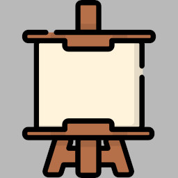

# cw-cf-0x07 - Canvas Clockface

Canvas Clockface permite cargar caratulas definidas en archivos JSON.

## Fuentes de Caratulas

| Fuente | Descripcion |
|---|---|
| Guardadas en reloj | Caratulas almacenadas en SPIFFS - funciona offline |
| GitHub Pages XE1E | `xe1e.github.io/Clockwise-XE1E/clockfaces/` - recomendado |
| CDN XE1E | `cdn.itaqui.to/xe1e/clockfaces/` |
| GitHub Raw | `raw.githubusercontent.com/jnthas/clock-club/` |
| Local | Servidor HTTP local para desarrollo |

## Almacenamiento Local

Las caratulas se pueden guardar permanentemente en el reloj:

- **Espacio:** ~1.5MB disponible en SPIFFS
- **Subir:** Desde la pagina de configuracion del reloj
- **Offline:** Funciona sin conexion a internet
- **Rotacion:** Compatible con rotacion y modo nocturno

## Fuentes Disponibles

El Canvas Clockface soporta 26+ fuentes:

| Fuente | Tamaño | Fuente | Tamaño |
|---|---|---|---|
| picopixel | 3x5 | tomthumb | 4x6 |
| 4x6 | 4x6 | 5x7 | 5x7 |
| 5x8 | 5x8 | 6x9 | 6x9 |
| 6x10 | 6x10 | 6x12 | 6x12 |
| 6x13 | 6x13 | 6x13B | 6x13 bold |
| 7x13 | 7x13 | 7x13B | 7x13 bold |
| 7x14 | 7x14 | 7x14B | 7x14 bold |
| 8x13 | 8x13 | 8x13B | 8x13 bold |
| spleen-5x8 | 5x8 | spleen-8x16 | 8x16 |
| creep | variable | scientifica | 5x11 |
| scientifica-bold | 5x11 | haxor-10 a 13 | 6x10-15 |
| clR6x12 | 6x12 | helvetica | variable |
| knxt | 8x20 | led-display | 14x17 |
| bold | 9pt | nocturno | 18pt |

## Formatos Especiales

| Formato | Descripcion | Ejemplo |
|---|---|---|
| `Hw` | Hora en palabras | "DIEZ" |
| `iw` | Minutos en palabras | "Y CUARTO" |

## Documentacion Original

Ver [Canvas Clockface Wiki](https://github.com/jnthas/clockwise/wiki/Canvas-Clockface)
